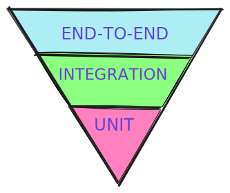
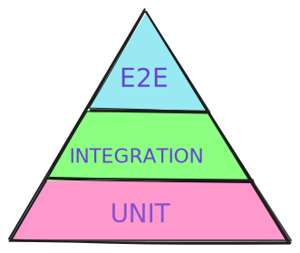
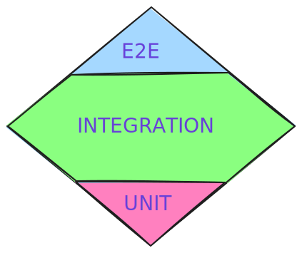
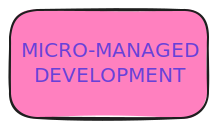
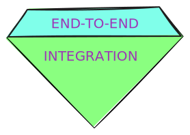
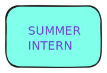

<link rel="stylesheet" href="https://cdnjs.cloudflare.com/ajax/libs/font-awesome/4.7.0/css/font-awesome.min.css">
<style>
  :root {
    --r-background-color: rgb(33, 34, 44);
    --grey: rgb(65, 69, 88);
    --white: rgb(248, 248, 242);
    --cyan: rgb(128, 255, 234);
    --green: rgb(138, 255, 128);
    --r-heading-color: rgb(255, 202, 128);
    --pink: rgb(255, 128, 191);
    --r-main-color: rgb(149, 128, 255);
    --red: rgb(255, 149, 128);
    --yellow: rgb(255, 255, 128);
     #FF80BF;
  }
  .larger {
    font-size: larger;
  }
  .small {
    font-size: 90%;
  }
  .small-column {
    float: left;
    width: 25%;
  }
  .third-column {
    float: left;
    width: 33%;
  }
  .column {
    float: left;
    width: 50%;
  }
  .large-column {
    float: left;
    width: 75%;
  }
  h1 {
    font-weight: 100;
  }
  img {
    loading: lazy;
  }
  .gif {
    height: 240px;
    width: 360px;
  }
  li {
    line-height: 2em;
  }
  emph {
    color: var(--red);
  }
  .lc {
    text-transform: lowercase;
  }
  .tips {
    padding: 0; /* Reset padding for the list */
    margin: 0;
  }
  .tips li {
    list-style: none; /* Remove default bullets */
    position: relative; /* Allow positioning of the pseudo-element */
    padding-left: 75px; /* Space for "TIP:" */
  }
  .tips li::before {
    content: "TIP:"; /* Add the "TIP:" text */
    position: absolute;
    left: 0;
    font-style: italic; /* Style as emphasized text */
    font-weight: bold;
    color:var(--green)
  }
</style>


<h1 style="white-space: nowrap"><emph>Testing Demystified:</emph></h1>
<h2><em>the boring,</em></h1>
<h2><strong style="color: var(--r-main-color);">the hard,</strong><h1>
<h2 style="text-decoration: underline; color: var(--green)">the practical</h1>

---

# About Me

<div class="column" style="margin-top: -90px;">
<h3 style="margin-top: 130px">Anto"nino" Cangialosi</h3>
Big Data Engineer<br/>
@ Agile Lab

<i class="fa fa-github fa-lg"> </i>
<i class="fa fa-gitlab fa-lg"> </i>
<i class="fa fa-slack fa-lg"> ninoCan</i><br/>
<i class="fa fa-linkedin"> antonino-cangialosi</i>

</div>

<div class="column">


</div>

---

<h2 style="white-space: nowrap">Testing Misconceptions</h1>
<div class="column">

</div>
<div class="column">

</div>
<div>

</div>

---

## <emph>Question:</emph> How many of you practice testing on their deliverables?

---

## <emph>Eye-ball test</emph>
## is the most common
## way of testing

---

<h2>Blueprint &amp; documentation</h2>
<div class=column>

</div>
<div class=column>
<ol style="margin: 30px 0px;">
  <li>Freeze requirements</li>
  <li>Example of usage</li>
  <li>Enable repeatability</li>
</ol>
</div>

---

<h2>why should we <emph class="larger;">prepare</emph> tests?</h2>

<ul>
  <li>enable rapid <emph class="larger">rework</emph></li>
  <li><emph>validate</emph> the work</li>
  <li>Remove the <emph class="larger">ego</emph></li>
</ul>

---

# <strong style="color: var(--r-main-color);">Hard</strong>

---

## Symptoms

<div class="column">

</div>
<div class="column">
<ul>
  <li>Different <emph>layers</emph></li>
  <li>Opaque <emph>jargon</emph></li>
  <li>Made more <emph>complex</emph></li>
  <li><emph>Elementary</emph> blocks</li>
</ul>
</div>

---

# <emph>Tests layers</emph>

<div class="third-column">
  <h2 style="color: var(--pink);">Unit</h2>
<ul style="color: var(--pink);">
  <li>finer detail</li>
  <li>isolation</li>
  <li>faster</li>
  <li>brittle</li>
</ul>
</div>
<div class="third-column">
  <h2 style="color: var(--green);">Integration</h2>
<ul style="color: var(--green);">
  <li>interfaces</li>
  <li>behavioural</li>
  <li>fast/slow</li>
  <li>durable</li>
</ul>
</div>
<div class="third-column">
  <h2 style="color: var(--cyan)">End-to-end</h2>
<ul style="color: var(--cyan);">
  <li>processes</li>
  <li>enseble</li>
  <li>slow</li>
  <li>error-prone</li>
</ul>
</div>

---

# <emph>Question:</emph> What is the right proportion?

---


<div class="third-column"></div>
<div class="third-column"></div>
<div class="third-column"></div>
<div>
<span style="opacity: 0; margin-top: -100px;">This is needed to correctly render the title!</span>
  <h1>
    It depends!</emph>
  </h1>
</div>
<div class="third-column"></div>
<div class="third-column"></div>
<div class="third-column"></div>

---

# <em>Boring</em>

---

## <span style="color: var(--green);">Feature</span> not a<emph> bug</emph>


---

<div class="large-column">
<h2>What is a <emph>test suite</emph>?</h2>
</div>

<div class="small-column">

</div>

A <emph>Test Case</emph> is just a set of boolean fuctions
```
class TestSuite:

  func testCase1 { actual == expected }

  func testCase2 {
    actual == expectation_1
    actual.part == expectation_2
  }

```
<ul class="tips">
  <li>DON'T use too many expectations<br></li>
  <li>cluster similar behaviour</li>
</ul>

---

## The 3 <emph class="larger">A</emph>s framework

<div class="column">
  <ul>
    <li>
      <emph class="larger">A</emph><emph class="small">RRANGE</emph><br>
      &nbsp;prepare the elements
    </li>
    <li>
      <emph class="larger">A</emph><emph class="small">CT</emph><br>
      &nbsp;let the music play
    </li>
    <li>
      <emph class="larger">A</emph><emph class="small">SSERT</emph><br>
    </li>
  </ul>
</div>
<div class="column">

```
class TestSuite:

  func testCase {
    # Arrange
    under_test = greet
    expected = "Hello, World!"

    # Act
    actual = under_test()

    # Assert
    actual == expected
  }

```

</div>

  <ul class="tips">
    <li>call the subject <strong>underTest</strong></li>
  </ul>

---


# Practical

---

# Thank you!